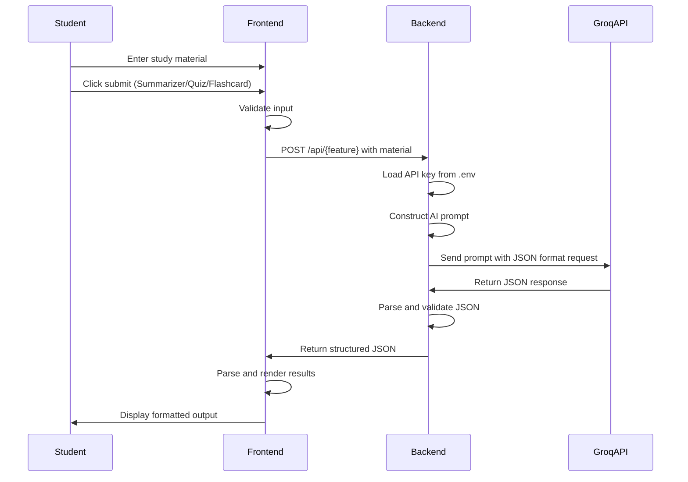

# Design Document

## Overview

TopicFlow is an AI-powered educational assistant web application that transforms study materials into structured learning resources. The system follows a client-server architecture with a Python backend (Flask/FastAPI) serving a vanilla JavaScript frontend styled with Tailwind CSS. The application integrates with the Groq API to provide three core features: AI Summarizer, AI Quiz Generator, and AI Flashcard Maker.

### Key Design Principles

1. **Separation of Concerns**: Clear separation between frontend presentation, backend API logic, and AI service integration
2. **Stateless API Design**: RESTful endpoints with no server-side session management
3. **Security First**: API key management through environment variables with proper .gitignore configuration
4. **Responsive Design**: Mobile-first approach using Tailwind CSS utility classes
5. **Error Resilience**: Comprehensive error handling at both frontend and backend layers

### Technology Stack

**Backend:**
- Python 3.12
- Flask or FastAPI (web framework)
- OpenAI client library (for Groq API integration)
- python-dotenv (environment variable management)

**Frontend:**
- Vanilla HTML5
- Vanilla JavaScript (ES6+)
- Tailwind CSS (responsive styling)
- Fetch API (HTTP requests)

**External Services:**
- Groq API (llama-3.1-8b-instant model)

## Architecture

### System Architecture

The application follows a three-tier architecture:

```
┌─────────────────────────────────────────────────────────────┐
│                        Frontend Layer                        │
│  ┌──────────────┐  ┌──────────────┐  ┌──────────────┐      │
│  │   index.html │  │   main.js    │  │  style.css   │      │
│  │  (Templates) │  │  (Logic)     │  │  (Tailwind)  │      │
│  └──────────────┘  └──────────────┘  └──────────────┘      │
└─────────────────────────────────────────────────────────────┘
                            │
                    HTTP/JSON (Fetch API)
                            │
┌─────────────────────────────────────────────────────────────┐
│                        Backend Layer                         │
│  ┌──────────────────────────────────────────────────────┐   │
│  │                      app.py                          │   │
│  │  ┌────────────┐  ┌────────────┐  ┌────────────┐    │   │
│  │  │ /api/      │  │ /api/quiz  │  │ /api/      │    │   │
│  │  │ summarize  │  │            │  │ flashcard  │    │   │
│  │  └────────────┘  └────────────┘  └────────────┘    │   │
│  └──────────────────────────────────────────────────────┘   │
└─────────────────────────────────────────────────────────────┘
                            │
                    HTTPS/JSON (OpenAI Client)
                            │
┌─────────────────────────────────────────────────────────────┐
│                     External Services                        │
│                    Groq API (llama-3.1-8b-instant)          │
└─────────────────────────────────────────────────────────────┘
```

### Request Flow

1. **User Input**: Student enters study material in the textarea
2. **Frontend Validation**: JavaScript validates input is non-empty
3. **API Request**: Frontend sends POST request with material to appropriate endpoint
4. **Backend Processing**: Backend receives request, validates, and constructs AI prompt
5. **AI Service Call**: Backend calls Groq API with structured prompt
6. **Response Parsing**: Backend parses JSON response from AI service
7. **Frontend Rendering**: Frontend receives JSON and renders appropriate UI components

### Data Flow



## Components and Interfaces

### Backend Components

#### 1. Application Server (app.py)

**Responsibilities:**
- Serve static files and templates
- Handle API routing
- Manage environment configuration
- Coordinate AI service calls

**Key Functions:**

```python
def load_api_key() -> str:
    """Load GROQ_API_KEY from .env file"""
    # Returns API key or raises error if missing

def create_groq_client(api_key: str) -> OpenAI:
    """Initialize OpenAI client configured for Groq API"""
    # Returns configured client instance

def call_ai_service(client: OpenAI, system_prompt: str, user_prompt: str) -> dict:
    """Make API call to Groq with JSON response format"""
    # Returns parsed JSON response or raises error
```

#### 2. Summarizer Component

**Endpoint:** `POST /api/summarize`

**Request Schema:**
```json
{
  "material": "string (study material text)"
}
```

**Response Schema:**
```json
{
  "summary": "string (bulleted summary text)"
}
```

**System Prompt:**
```
You are an educational assistant that creates concise summaries. 
Generate a bulleted summary of the key points from the provided material. 
Return the response as JSON with a 'summary' field containing the bulleted text.
```

**Error Responses:**
- 400: Missing or empty material
- 500: AI service error or API key issues

#### 3. Quiz Generator Component

**Endpoint:** `POST /api/quiz`

**Request Schema:**
```json
{
  "material": "string (study material text)"
}
```

**Response Schema:**
```json
{
  "questions": [
    {
      "question": "string",
      "choices": ["string", "string", "string", "string"],
      "correct_answer": "string",
      "explanation": "string"
    }
  ]
}
```

**System Prompt:**
```
You are an educational assistant that creates quiz questions. 
Generate exactly 5 multiple-choice questions from the provided material. 
Each question must have 4 answer choices, one correct answer, and an explanation. 
Return the response as JSON with a 'questions' array.
```

**Constraints:**
- Exactly 5 questions per request
- Each question has exactly 4 choices
- One correct answer per question
- Explanation provided for each question

**Error Responses:**
- 400: Missing or empty material
- 500: AI service error or API key issues

#### 4. Flashcard Maker Component

**Endpoint:** `POST /api/flashcard`

**Request Schema:**
```json
{
  "material": "string (study material text)"
}
```

**Response Schema:**
```json
{
  "flashcards": [
    {
      "term": "string",
      "definition": "string"
    }
  ]
}
```

**System Prompt:**
```
You are an educational assistant that creates flashcards. 
Extract key terms and their definitions from the provided material. 
Return the response as JSON with a 'flashcards' array containing term-definition pairs.
```

**Error Responses:**
- 400: Missing or empty material
- 500: AI service error or API key issues

### Frontend Components

#### 1. Tab Navigation System

**Responsibilities:**
- Manage tab switching
- Show/hide content panels
- Indicate active tab state

**Implementation:**
```javascript
function switchTab(tabName) {
  // Hide all content panels
  // Show selected content panel
  // Update active tab styling
}
```

**Tab Structure:**
- Material Input Area
- AI Summarizer
- AI Quiz Generator
- AI Flashcard Maker
- About

#### 2. Material Input Component

**Responsibilities:**
- Accept multi-line text input
- Validate input is non-empty
- Enable/disable submit buttons based on input state

**HTML Structure:**
```html
<textarea id="material-input" 
          class="w-full p-4 border rounded-lg"
          placeholder="Enter your study material here...">
</textarea>
```

**Validation:**
- Disable submit buttons when textarea is empty
- Trim whitespace before validation
- Show validation message on empty submission

#### 3. Summarizer UI Component

**Responsibilities:**
- Display submit button
- Show loading indicator during API call
- Render bulleted summary results
- Display error messages

**Result Rendering:**
```javascript
function renderSummary(summaryText) {
  // Parse summary text
  // Create bulleted list HTML
  // Display in results container
}
```

#### 4. Quiz UI Component

**Responsibilities:**
- Display submit button
- Show loading indicator during API call
- Render interactive quiz questions
- Handle answer selection
- Reveal correct answers and explanations

**Question Rendering:**
```javascript
function renderQuiz(questions) {
  // For each question:
  //   - Display question text
  //   - Render selectable answer choices
  //   - Attach click handlers
  //   - Show explanation after selection
}
```

**Interaction Flow:**
1. Display all 5 questions with answer choices
2. Student clicks an answer choice
3. Highlight selected answer
4. Reveal correct answer (green) and incorrect answers (red)
5. Display explanation below question

#### 5. Flashcard UI Component

**Responsibilities:**
- Display submit button
- Show loading indicator during API call
- Render interactive flashcards
- Handle flip animation between term and definition

**Flashcard Rendering:**
```javascript
function renderFlashcards(flashcards) {
  // For each flashcard:
  //   - Create card element with front (term) and back (definition)
  //   - Attach click handler for flip animation
  //   - Apply Tailwind CSS for styling
}
```

**Interaction:**
- Click card to flip from term to definition
- Click again to flip back
- Navigate between multiple flashcards

#### 6. About Component

**Responsibilities:**
- Display application description
- Show developer information (names and NIMs)
- Provide context about the project

**Content:**
- Application purpose and features
- Developer names and student IDs
- Project context (AI Midterm Exam 2026)

### API Client Module (Frontend)

**Responsibilities:**
- Make HTTP requests to backend
- Handle loading states
- Parse JSON responses
- Display error messages

**Core Functions:**

```javascript
async function callAPI(endpoint, material) {
  // Show loading indicator
  // Make POST request with Fetch API
  // Parse JSON response
  // Hide loading indicator
  // Return data or throw error
}

function showLoading() {
  // Display loading spinner/message
}

function hideLoading() {
  // Hide loading spinner/message
}

function showError(message) {
  // Display error message to user
}
```

## Data Models

### Material Input

```typescript
interface MaterialInput {
  material: string;  // Multi-line study text, non-empty
}
```

**Validation Rules:**
- Must not be empty or whitespace-only
- No maximum length constraint (handled by AI service limits)

### Summary Response

```typescript
interface SummaryResponse {
  summary: string;  // Bulleted summary text with newlines
}
```

**Format:**
- Bulleted list format (• or - prefixed lines)
- Multiple bullet points separated by newlines

### Quiz Response

```typescript
interface QuizQuestion {
  question: string;        // Question text
  choices: string[];       // Array of 4 answer choices
  correct_answer: string;  // The correct answer (must match one choice)
  explanation: string;     // Explanation of the correct answer
}

interface QuizResponse {
  questions: QuizQuestion[];  // Array of exactly 5 questions
}
```

**Validation Rules:**
- Exactly 5 questions in array
- Each question has exactly 4 choices
- correct_answer must match one of the choices
- All fields are non-empty strings

### Flashcard Response

```typescript
interface Flashcard {
  term: string;        // Key term or concept
  definition: string;  // Definition or explanation
}

interface FlashcardResponse {
  flashcards: Flashcard[];  // Array of flashcards (variable length)
}
```

**Validation Rules:**
- At least 1 flashcard in array
- Both term and definition are non-empty strings

### Error Response

```typescript
interface ErrorResponse {
  error: string;  // Human-readable error message
}
```

**HTTP Status Codes:**
- 400: Bad Request (invalid input)
- 500: Internal Server Error (AI service failure, API key issues)

## Data Models

### Environment Configuration

```typescript
interface EnvironmentConfig {
  GROQ_API_KEY: string;  // API key loaded from .env file
}
```

**Security Requirements:**
- Stored in .env file (not committed to git)
- Loaded using python-dotenv
- Never exposed in frontend code or API responses

### AI Service Configuration

```typescript
interface AIServiceConfig {
  base_url: string;           // "https://api.groq.com/openai/v1"
  model: string;              // "llama-3.1-8b-instant"
  response_format: {
    type: string;             // "json_object"
  };
}
```

## Error Handling

### Backend Error Handling

#### 1. API Key Errors

**Scenario:** Missing or invalid GROQ_API_KEY in .env file

**Handling:**
```python
try:
    api_key = os.getenv("GROQ_API_KEY")
    if not api_key:
        raise ValueError("GROQ_API_KEY not found in environment")
except Exception as e:
    return {"error": "API key configuration error"}, 500
```

**Response:**
- HTTP 500
- JSON: `{"error": "API key configuration error"}`

#### 2. AI Service Errors

**Scenario:** Groq API is unavailable, rate limited, or returns error

**Handling:**
```python
try:
    response = client.chat.completions.create(...)
except Exception as e:
    return {"error": "AI service unavailable. Please try again later."}, 500
```

**Response:**
- HTTP 500
- JSON: `{"error": "AI service unavailable. Please try again later."}`

#### 3. Invalid Input Errors

**Scenario:** Empty or missing material in request

**Handling:**
```python
material = request.json.get("material", "").strip()
if not material:
    return {"error": "Material input is required"}, 400
```

**Response:**
- HTTP 400
- JSON: `{"error": "Material input is required"}`

#### 4. JSON Parsing Errors

**Scenario:** AI service returns malformed JSON

**Handling:**
```python
try:
    result = json.loads(response.choices[0].message.content)
except json.JSONDecodeError:
    return {"error": "Failed to parse AI response"}, 500
```

**Response:**
- HTTP 500
- JSON: `{"error": "Failed to parse AI response"}`

### Frontend Error Handling

#### 1. Network Errors

**Scenario:** Cannot reach backend API

**Handling:**
```javascript
try {
  const response = await fetch(endpoint, options);
  if (!response.ok) {
    throw new Error(`HTTP ${response.status}`);
  }
} catch (error) {
  showError("Network error. Please check your connection.");
}
```

**User Feedback:**
- Display error message in UI
- Hide loading indicator
- Keep user input intact for retry

#### 2. Validation Errors

**Scenario:** User attempts to submit empty material

**Handling:**
```javascript
const material = document.getElementById("material-input").value.trim();
if (!material) {
  showError("Please enter study material before submitting.");
  return;
}
```

**User Feedback:**
- Display validation message
- Focus on textarea
- Do not make API call

#### 3. JSON Parsing Errors

**Scenario:** Backend returns malformed JSON

**Handling:**
```javascript
try {
  const data = await response.json();
} catch (error) {
  showError("Failed to parse response. Please try again.");
}
```

**User Feedback:**
- Display error message
- Allow user to retry

#### 4. Empty Results

**Scenario:** AI service returns empty or unexpected data

**Handling:**
```javascript
if (!data.summary || data.summary.trim() === "") {
  showError("No summary generated. Please try different material.");
}
```

**User Feedback:**
- Display helpful message
- Suggest trying different input

### Error Recovery Strategies

1. **Retry Logic**: Frontend allows users to retry failed requests without losing input
2. **Graceful Degradation**: Display partial results if some data is valid
3. **User Guidance**: Provide actionable error messages (e.g., "Try shorter text" for length errors)
4. **Logging**: Backend logs errors for debugging (without exposing sensitive data)


## Correctness Properties

*A property is a characteristic or behavior that should hold true across all valid executions of a system—essentially, a formal statement about what the system should do. Properties serve as the bridge between human-readable specifications and machine-verifiable correctness guarantees.*

### Property 1: Input Validation Controls Button State

*For any* input state (empty, whitespace-only, or valid text), the submit buttons SHALL be disabled when input is invalid (empty or whitespace-only) and enabled when input is valid.

**Validates: Requirements 4.4**

### Property 2: Tab Navigation Exclusivity and State

*For any* tab selection, the corresponding content panel SHALL be visible, all other content panels SHALL be hidden, and the selected tab SHALL have active styling applied.

**Validates: Requirements 5.2, 5.3, 5.4**

### Property 3: API Request Structure for Summarizer

*For any* valid material input, when the Summarizer submit button is clicked, the frontend SHALL send a POST request to /api/summarize with a JSON payload containing the material field.

**Validates: Requirements 6.2**

### Property 4: Summarizer JSON Response Structure

*For any* AI service response (mocked), the /api/summarize endpoint SHALL return valid JSON containing a "summary" field with non-empty string value.

**Validates: Requirements 6.5**

### Property 5: Summary Display Formatting

*For any* summary text received from the backend, the frontend SHALL render it in bulleted format with proper list styling.

**Validates: Requirements 6.6**

### Property 6: API Request Structure for Quiz Generator

*For any* valid material input, when the Quiz Generator submit button is clicked, the frontend SHALL send a POST request to /api/quiz with a JSON payload containing the material field.

**Validates: Requirements 7.2**

### Property 7: Quiz JSON Response Structure

*For any* AI service response (mocked), the /api/quiz endpoint SHALL return valid JSON containing a "questions" array where each question includes "question", "choices" (array of 4 strings), "correct_answer", and "explanation" fields.

**Validates: Requirements 7.5**

### Property 8: Quiz Display and Interaction

*For any* quiz response data, the frontend SHALL render all questions with selectable answer choices, and when any answer is selected, SHALL reveal the correct answer with highlighting and display the explanation.

**Validates: Requirements 7.6, 7.7**

### Property 9: API Request Structure for Flashcard Maker

*For any* valid material input, when the Flashcard Maker submit button is clicked, the frontend SHALL send a POST request to /api/flashcard with a JSON payload containing the material field.

**Validates: Requirements 8.2**

### Property 10: Flashcard JSON Response Structure

*For any* AI service response (mocked), the /api/flashcard endpoint SHALL return valid JSON containing a "flashcards" array where each flashcard includes "term" and "definition" fields with non-empty string values.

**Validates: Requirements 8.5**

### Property 11: Flashcard Flip Interaction

*For any* flashcard data, clicking a flashcard SHALL toggle the display between term and definition views.

**Validates: Requirements 8.6**

### Property 12: AI Service Configuration Consistency

*For any* AI service call across all endpoints (summarize, quiz, flashcard), the request SHALL include model parameter "llama-3.1-8b-instant" and response_format parameter {"type": "json_object"}.

**Validates: Requirements 10.3, 10.4**

### Property 13: JSON Response Content-Type Header

*For any* successful API response from any endpoint, the response SHALL include Content-Type header set to "application/json".

**Validates: Requirements 12.1**

### Property 14: JSON Serialization Round-Trip

*For any* response data structure (summary, quiz, flashcard), serializing to JSON and parsing back SHALL produce an equivalent data structure with all fields preserved.

**Validates: Requirements 12.2**

### Property 15: Error Display on API Failure

*For any* API error response (4xx or 5xx status code), the frontend SHALL display an error message to the user.

**Validates: Requirements 14.1**

### Property 16: Loading Indicator Lifecycle

*For any* API request, the frontend SHALL display a loading indicator when the request starts and hide the loading indicator when the request completes (either success or failure).

**Validates: Requirements 14.4, 14.5**

### Property 17: AI Service Error Handling

*For any* endpoint (/api/summarize, /api/quiz, /api/flashcard), when the AI service call fails or returns an error, the endpoint SHALL return HTTP status code 500 with a JSON error message.

**Validates: Requirements 6.7, 7.8, 8.7**

## Testing Strategy

### Overview

TopicFlow requires a comprehensive testing strategy that combines unit tests, integration tests, and property-based tests to ensure correctness across all components. The testing approach recognizes that while the AI service integration is non-deterministic and external, the wrapper logic, validation, data transformations, and UI interactions can be thoroughly tested.

### Testing Approach

**Three-Tier Testing Strategy:**

1. **Unit Tests**: Test individual functions and components in isolation with specific examples and edge cases
2. **Integration Tests**: Test API endpoints and external service integration with mocked AI responses
3. **Property-Based Tests**: Verify universal properties across all valid inputs using randomized test data

### Property-Based Testing

**Framework Selection:**
- **Python Backend**: Use `hypothesis` library for property-based testing
- **JavaScript Frontend**: Use `fast-check` library for property-based testing

**Configuration:**
- Minimum 100 iterations per property test
- Each property test must include a comment tag referencing the design property
- Tag format: `# Feature: topicflow, Property {number}: {property_text}`

**Property Test Implementation Guidelines:**

1. **Mock External Dependencies**: All property tests SHALL mock the Groq API to test wrapper logic independently
2. **Generate Diverse Inputs**: Use property test generators to create varied test data (strings, arrays, objects)
3. **Verify Invariants**: Each test SHALL verify the universal property holds across all generated inputs
4. **Test Boundaries**: Generators SHALL include edge cases (empty strings, whitespace, special characters, large inputs)

**Example Property Test Structure (Python):**

```python
from hypothesis import given, strategies as st
import json

# Feature: topicflow, Property 14: JSON Serialization Round-Trip
@given(st.dictionaries(st.text(), st.text()))
def test_json_round_trip(data):
    """For any response data, JSON serialization round-trip preserves structure"""
    serialized = json.dumps(data)
    deserialized = json.loads(serialized)
    assert deserialized == data
```

**Example Property Test Structure (JavaScript):**

```javascript
const fc = require('fast-check');

// Feature: topicflow, Property 1: Input Validation Controls Button State
fc.assert(
  fc.property(fc.string(), (input) => {
    const isValid = input.trim().length > 0;
    const buttonEnabled = checkButtonState(input);
    return buttonEnabled === isValid;
  }),
  { numRuns: 100 }
);
```

### Unit Testing

**Backend Unit Tests (Python):**

**Test Coverage:**
- API key loading from environment
- Input validation (empty, whitespace, valid)
- JSON response structure validation
- Error handling for missing API key
- Error handling for AI service failures
- Prompt construction for each feature

**Test Framework:** `pytest`

**Example Tests:**
```python
def test_empty_material_returns_400():
    """Test that empty material input returns 400 error"""
    response = client.post('/api/summarize', json={'material': ''})
    assert response.status_code == 400
    assert 'error' in response.json

def test_missing_api_key_returns_500():
    """Test that missing API key returns 500 error"""
    with mock.patch.dict(os.environ, {}, clear=True):
        response = client.post('/api/summarize', json={'material': 'test'})
        assert response.status_code == 500
```

**Frontend Unit Tests (JavaScript):**

**Test Coverage:**
- Tab switching logic
- Input validation
- Button enable/disable logic
- Error message display
- Loading indicator show/hide
- JSON parsing and error handling

**Test Framework:** `Jest` or `Vitest`

**Example Tests:**
```javascript
test('empty input disables submit button', () => {
  const input = document.getElementById('material-input');
  const button = document.getElementById('submit-button');
  
  input.value = '';
  updateButtonState();
  
  expect(button.disabled).toBe(true);
});

test('valid input enables submit button', () => {
  const input = document.getElementById('material-input');
  const button = document.getElementById('submit-button');
  
  input.value = 'Valid study material';
  updateButtonState();
  
  expect(button.disabled).toBe(false);
});
```

### Integration Testing

**Backend Integration Tests:**

**Test Coverage:**
- Full request/response cycle for each endpoint
- Static file serving
- Template rendering
- AI service integration with mocked responses
- Error responses for various failure scenarios

**Mocking Strategy:**
- Mock Groq API responses using `unittest.mock` or `pytest-mock`
- Test with various AI response formats (valid, invalid, empty)
- Simulate AI service failures (timeouts, errors, rate limits)

**Example Integration Test:**
```python
@mock.patch('openai.OpenAI')
def test_summarize_endpoint_with_mocked_ai(mock_openai):
    """Test /api/summarize with mocked AI response"""
    mock_response = {
        'choices': [{
            'message': {
                'content': '{"summary": "• Point 1\\n• Point 2\\n• Point 3"}'
            }
        }]
    }
    mock_openai.return_value.chat.completions.create.return_value = mock_response
    
    response = client.post('/api/summarize', json={'material': 'Test material'})
    
    assert response.status_code == 200
    assert 'summary' in response.json
    assert '• Point 1' in response.json['summary']
```

**Frontend Integration Tests:**

**Test Coverage:**
- Full user interaction flows (input → submit → display results)
- API request/response handling
- Error handling for network failures
- UI state transitions

**Test Framework:** `Playwright` or `Cypress` for end-to-end tests

**Example Integration Test:**
```javascript
test('summarizer flow displays results', async () => {
  // Mock API response
  await page.route('/api/summarize', route => {
    route.fulfill({
      status: 200,
      contentType: 'application/json',
      body: JSON.stringify({ summary: '• Key point 1\n• Key point 2' })
    });
  });
  
  // Fill input and submit
  await page.fill('#material-input', 'Study material');
  await page.click('#summarize-submit');
  
  // Verify results displayed
  await expect(page.locator('.summary-results')).toContainText('Key point 1');
});
```

### Smoke Tests

**Purpose:** Verify project structure, configuration, and environment setup

**Test Coverage:**
- File structure verification (app.py, templates/, static/, .env, .gitignore, requirements.txt)
- Python version check
- Framework import verification (Flask or FastAPI)
- Dependency verification in requirements.txt
- .gitignore contains .env
- No hardcoded API keys in source code
- Tailwind CSS classes present in HTML
- No prohibited frameworks (jQuery, React, Vue) in frontend code

**Test Framework:** Custom Python script or `pytest`

**Example Smoke Tests:**
```python
def test_project_structure():
    """Verify all required files exist"""
    assert os.path.exists('app.py')
    assert os.path.exists('templates/index.html')
    assert os.path.exists('static/css/style.css')
    assert os.path.exists('static/js/main.js')
    assert os.path.exists('.env')
    assert os.path.exists('.gitignore')
    assert os.path.exists('requirements.txt')

def test_gitignore_excludes_env():
    """Verify .gitignore contains .env"""
    with open('.gitignore', 'r') as f:
        content = f.read()
    assert '.env' in content

def test_requirements_contains_dependencies():
    """Verify requirements.txt contains required dependencies"""
    with open('requirements.txt', 'r') as f:
        content = f.read()
    assert 'flask' in content.lower() or 'fastapi' in content.lower()
    assert 'python-dotenv' in content.lower()
    assert 'openai' in content.lower()
```

### Example-Based Tests

**Purpose:** Test specific scenarios, UI elements, and concrete examples

**Test Coverage:**
- Specific UI elements exist (tabs, buttons, textarea)
- Static file serving works
- Template rendering works
- Specific error cases (empty input, malformed JSON, AI service failure)
- Responsive design at specific breakpoints (320px, 768px, 1024px, 1920px)
- About page content (developer names, NIMs, description)
- Correct prompts sent to AI service for each feature

**Example Tests:**
```python
def test_all_tabs_exist():
    """Verify all 5 tabs are present in UI"""
    response = client.get('/')
    html = response.data.decode()
    assert 'Material Input Area' in html
    assert 'AI Summarizer' in html
    assert 'AI Quiz Generator' in html
    assert 'AI Flashcard Maker' in html
    assert 'About' in html

def test_quiz_returns_exactly_5_questions():
    """Verify quiz endpoint returns exactly 5 questions"""
    with mock_ai_service():
        response = client.post('/api/quiz', json={'material': 'Test'})
        data = response.json
        assert len(data['questions']) == 5
```

### Test Execution Strategy

**Development Workflow:**
1. Run unit tests on every code change (fast feedback)
2. Run property-based tests before commits (comprehensive coverage)
3. Run integration tests before pull requests (end-to-end validation)
4. Run smoke tests on deployment (environment verification)

**Continuous Integration:**
- All tests run on every commit
- Property-based tests run with 100 iterations minimum
- Integration tests run with mocked AI service
- Code coverage target: 80% minimum

**Test Organization:**
```
tests/
├── unit/
│   ├── backend/
│   │   ├── test_api_endpoints.py
│   │   ├── test_validation.py
│   │   └── test_error_handling.py
│   └── frontend/
│       ├── test_tab_navigation.js
│       ├── test_input_validation.js
│       └── test_api_client.js
├── integration/
│   ├── test_summarizer_flow.py
│   ├── test_quiz_flow.py
│   └── test_flashcard_flow.py
├── property/
│   ├── test_json_properties.py
│   ├── test_ui_properties.js
│   └── test_api_properties.py
└── smoke/
    └── test_project_structure.py
```

### Testing Non-Deterministic AI Behavior

**Challenge:** AI service responses are non-deterministic and cannot be tested with exact assertions

**Solution:** Test the wrapper logic, not the AI output

**Approach:**
1. **Mock AI Responses**: Use fixed mock responses to test parsing and rendering logic
2. **Test Structure, Not Content**: Verify response has correct fields and types, not specific values
3. **Test Error Handling**: Verify system handles AI failures gracefully
4. **Integration Tests**: Run occasional manual tests with real AI service to verify prompts work

**Example:**
```python
@mock.patch('openai.OpenAI')
def test_quiz_response_structure(mock_openai):
    """Test that quiz response has correct structure, regardless of content"""
    mock_response = create_mock_quiz_response()  # Fixed mock data
    mock_openai.return_value.chat.completions.create.return_value = mock_response
    
    response = client.post('/api/quiz', json={'material': 'Test'})
    data = response.json
    
    # Test structure, not content
    assert 'questions' in data
    assert isinstance(data['questions'], list)
    assert len(data['questions']) == 5
    for q in data['questions']:
        assert 'question' in q
        assert 'choices' in q
        assert len(q['choices']) == 4
        assert 'correct_answer' in q
        assert 'explanation' in q
```

### Manual Testing Checklist

**UI/UX Testing:**
- [ ] All tabs are clickable and switch content correctly
- [ ] Material input textarea accepts multi-line text
- [ ] Submit buttons are disabled when input is empty
- [ ] Loading indicators appear during API calls
- [ ] Results display correctly for each feature
- [ ] Error messages are clear and helpful
- [ ] Responsive design works on mobile, tablet, and desktop
- [ ] Flashcards flip smoothly between term and definition
- [ ] Quiz answers highlight correctly after selection

**Integration Testing with Real AI Service:**
- [ ] Summarizer generates relevant bullet points
- [ ] Quiz generates 5 questions with 4 choices each
- [ ] Flashcards extract meaningful terms and definitions
- [ ] Error handling works when API key is invalid
- [ ] Error handling works when AI service is unavailable

### Success Criteria

Testing is considered successful when:
1. All unit tests pass with 80%+ code coverage
2. All property-based tests pass with 100 iterations minimum
3. All integration tests pass with mocked AI service
4. All smoke tests pass verifying project structure
5. Manual testing confirms UI/UX works as expected
6. No hardcoded API keys found in codebase
7. Error handling gracefully manages all failure scenarios
